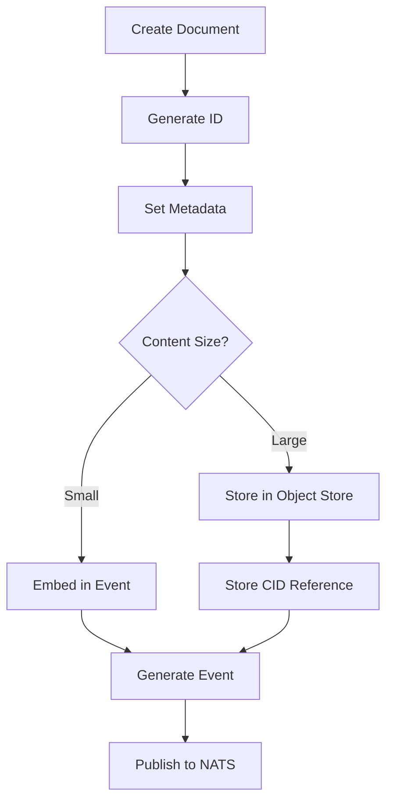
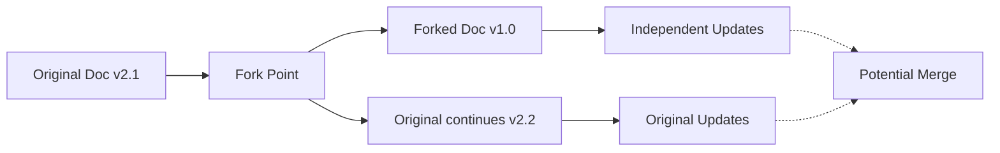
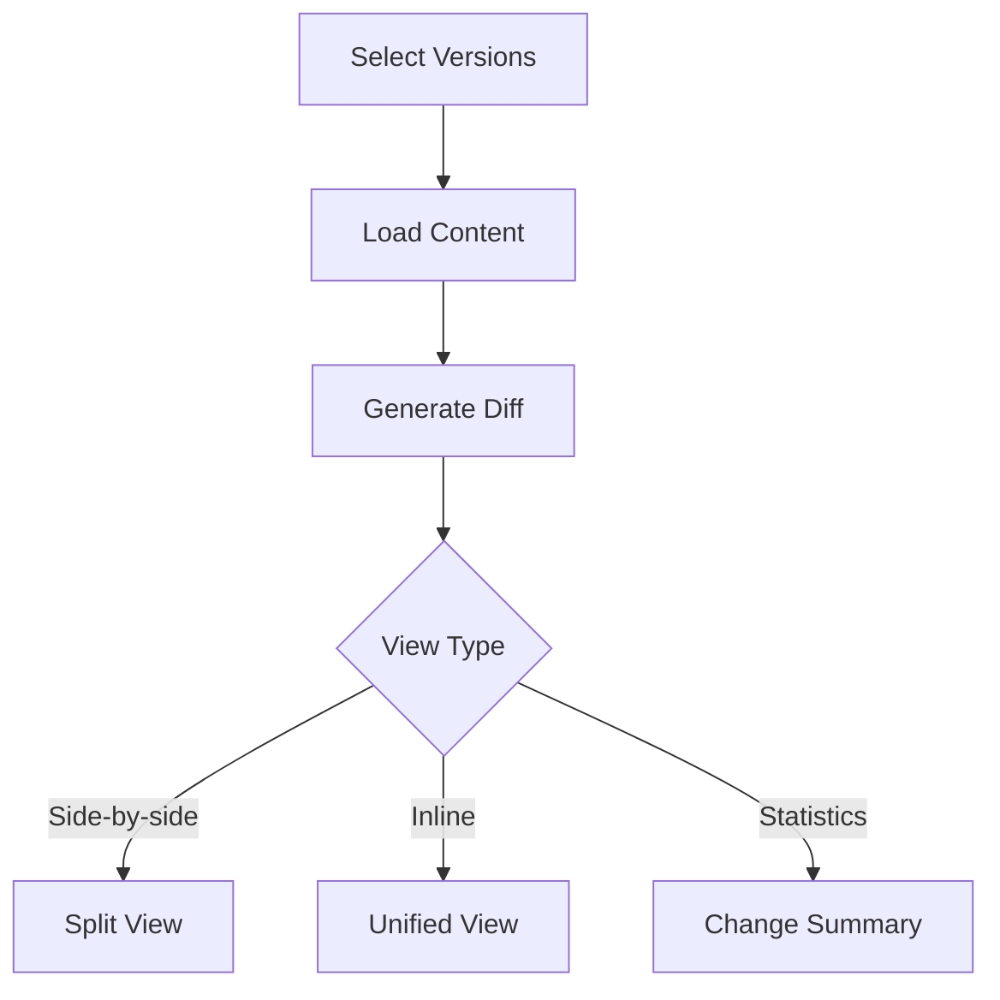
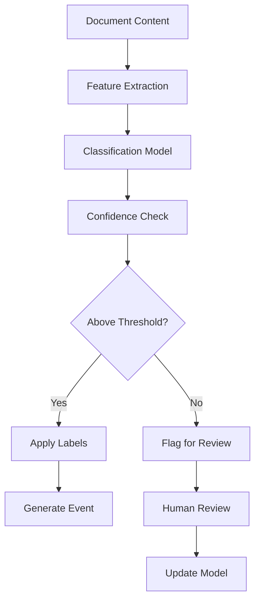
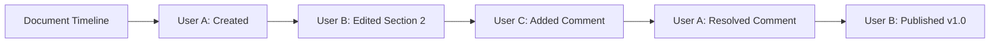
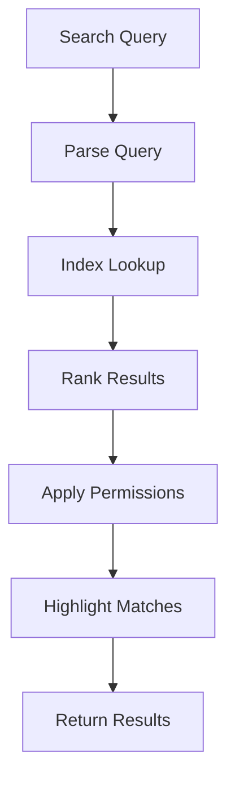

# User Stories for Document Domain

## Overview

User stories for the Document domain module, which manages content creation, versioning, collaboration, and intelligent document processing in the CIM system.

## Document Creation and Management

### Story D1: Create New Document
**As a** content creator  
**I want** to create a new document  
**So that** I can capture and share information

**Acceptance Criteria:**
- Document created with unique ID (UUID v7)
- Initial version (1.0.0) established
- Author/owner recorded
- DocumentCreated event generated with CID
- Content stored in object store if large

**Mermaid Diagram:**

**Tests:** `test_create_document`, `test_large_content_storage`

### Story D2: Update Document Content
**As a** document author  
**I want** to update document content  
**So that** information stays current

**Acceptance Criteria:**
- New version created (semantic versioning)
- Previous version preserved
- Change summary captured
- DocumentUpdated event generated
- Diff available between versions

**Tests:** `test_update_document`, `test_version_preservation`

### Story D3: Fork Document
**As a** collaborator  
**I want** to fork a document  
**So that** I can work on variations independently

**Acceptance Criteria:**
- New document created with fork relationship
- Original document referenced
- Fork point version recorded
- DocumentForked event generated
- Permissions inherited optionally

**Mermaid Diagram:**

**Tests:** `test_fork_document`, `test_fork_independence`

### Story D4: Merge Document Changes
**As a** document owner  
**I want** to merge changes from forks  
**So that** improvements can be incorporated

**Acceptance Criteria:**
- Conflict detection implemented
- Three-way merge supported
- Merge commit created
- DocumentMerged event generated
- Rollback capability preserved

**Tests:** `test_merge_documents`, `test_conflict_resolution`

## Version Control

### Story D5: Tag Document Version
**As a** document manager  
**I want** to tag specific versions  
**So that** important milestones are marked

**Acceptance Criteria:**
- Named tags supported (e.g., "v1.0-release")
- Tag metadata included
- DocumentTagged event generated
- Tags immutable once created
- Tag listing and search

**Tests:** `test_tag_version`, `test_tag_immutability`

### Story D6: Rollback to Previous Version
**As a** document owner  
**I want** to rollback to a previous version  
**So that** mistakes can be undone

**Acceptance Criteria:**
- Any previous version restorable
- Rollback creates new version
- Rollback reason recorded
- DocumentRolledBack event generated
- History preserved

**Tests:** `test_rollback_version`, `test_rollback_history`

### Story D7: Compare Document Versions
**As a** reviewer  
**I want** to compare document versions  
**So that** I can see what changed

**Acceptance Criteria:**
- Side-by-side comparison
- Inline diff view
- Change statistics provided
- Author attribution shown
- Export diff capability

**Mermaid Diagram:**

**Tests:** `test_version_comparison`, `test_diff_generation`

## Content Intelligence

### Story D8: Extract Document Entities
**As a** knowledge worker  
**I want** entities extracted from documents  
**So that** content is semantically enriched

**Acceptance Criteria:**
- Named entities identified (people, places, orgs)
- Concepts and topics extracted
- EntitiesExtracted event generated
- Confidence scores provided
- Manual correction supported

**Tests:** `test_entity_extraction`, `test_extraction_accuracy`

### Story D9: Generate Document Summary
**As a** busy reader  
**I want** automatic document summaries  
**So that** I can quickly understand content

**Acceptance Criteria:**
- Multiple summary lengths (brief, standard, detailed)
- Key points highlighted
- SummaryGenerated event generated
- Language preserved
- Quality metrics tracked

**Tests:** `test_summary_generation`, `test_summary_quality`

### Story D10: Classify Document Content
**As a** content organizer  
**I want** documents automatically classified  
**So that** they're properly categorized

**Acceptance Criteria:**
- Multi-label classification supported
- Confidence thresholds configurable
- DocumentClassified event generated
- Custom taxonomies supported
- Continuous learning from corrections

**Mermaid Diagram:**

**Tests:** `test_document_classification`, `test_classification_learning`

## Collaboration Features

### Story D11: Share Document
**As a** document owner  
**I want** to share documents with others  
**So that** we can collaborate

**Acceptance Criteria:**
- Share with individuals or groups
- Permission levels (view, comment, edit)
- DocumentShared event generated
- Expiring shares supported
- Share link generation

**Tests:** `test_share_document`, `test_permission_enforcement`

### Story D12: Comment on Document
**As a** reviewer  
**I want** to add comments to documents  
**So that** I can provide feedback

**Acceptance Criteria:**
- Inline comments on specific content
- Thread discussions supported
- CommentAdded event generated
- @mentions notify users
- Comment resolution tracking

**Tests:** `test_add_comments`, `test_comment_threads`

### Story D13: Track Document Changes
**As a** collaborator  
**I want** to see who changed what  
**So that** I understand document evolution

**Acceptance Criteria:**
- Change attribution preserved
- Timeline view available
- Activity feed generated
- Filters by author/date/type
- Export audit trail

**Mermaid Diagram:**

**Tests:** `test_change_tracking`, `test_activity_timeline`

## Document Organization

### Story D14: Create Document Collections
**As a** content manager  
**I want** to organize documents into collections  
**So that** related content is grouped

**Acceptance Criteria:**
- Hierarchical collections supported
- Documents in multiple collections
- CollectionCreated event generated
- Collection metadata (description, tags)
- Access control per collection

**Tests:** `test_create_collection`, `test_collection_hierarchy`

### Story D15: Link Related Documents
**As a** knowledge curator  
**I want** to link related documents  
**So that** connections are explicit

**Acceptance Criteria:**
- Bidirectional links supported
- Link types (references, related, supersedes)
- DocumentsLinked event generated
- Link metadata preserved
- Broken link detection

**Tests:** `test_link_documents`, `test_link_integrity`

### Story D16: Apply Document Templates
**As a** content creator  
**I want** to use document templates  
**So that** consistency is maintained

**Acceptance Criteria:**
- Template library available
- Custom templates supported
- TemplateApplied event generated
- Variable substitution
- Template versioning

**Tests:** `test_apply_template`, `test_template_variables`

## Search and Discovery

### Story D17: Search Document Content
**As a** user  
**I want** to search within documents  
**So that** I can find specific information

**Acceptance Criteria:**
- Full-text search supported
- Advanced query syntax
- Search results ranked
- Highlighting in results
- Search history preserved

**Mermaid Diagram:**

**Tests:** `test_document_search`, `test_search_ranking`

### Story D18: Find Similar Documents
**As a** researcher  
**I want** to find similar documents  
**So that** I can discover related content

**Acceptance Criteria:**
- Semantic similarity calculated
- Multiple similarity metrics
- SimilaritySearchPerformed event generated
- Threshold configurable
- Explanation provided

**Tests:** `test_similarity_search`, `test_similarity_metrics`

## Document Lifecycle

### Story D19: Archive Document
**As a** records manager  
**I want** to archive old documents  
**So that** active content stays relevant

**Acceptance Criteria:**
- Move to archive storage
- Maintain searchability
- DocumentArchived event generated
- Restoration supported
- Retention policies applied

**Tests:** `test_archive_document`, `test_document_restoration`

### Story D20: Delete Document
**As a** document owner  
**I want** to delete documents  
**So that** outdated content is removed

**Acceptance Criteria:**
- Soft delete with recovery period
- Hard delete after confirmation
- DocumentDeleted event generated
- Cascade to dependent content
- Compliance with retention rules

**Tests:** `test_delete_document`, `test_deletion_compliance`

## Integration Features

### Story D21: Import External Documents
**As a** user  
**I want** to import documents from external sources  
**So that** I can work with existing content

**Acceptance Criteria:**
- Multiple formats supported (PDF, Word, Markdown)
- Metadata extraction
- DocumentImported event generated
- Format conversion available
- Batch import capability

**Tests:** `test_import_documents`, `test_format_conversion`

### Story D22: Export Document
**As a** user  
**I want** to export documents  
**So that** I can use them elsewhere

**Acceptance Criteria:**
- Multiple export formats
- Include version history optionally
- DocumentExported event generated
- Watermarking supported
- Batch export available

**Tests:** `test_export_document`, `test_export_formats`

## Legend

- 📄 Core document functionality
- 🤖 AI-powered features
- 👥 Collaboration capabilities
- 🔍 Search and discovery

## Test Coverage Requirements

- Unit tests for all document operations
- Integration tests for versioning flows
- Performance tests for large documents
- AI feature accuracy tests
- Collaboration concurrency tests 