# User Story: CID-First Document Ingestion

**ID:** US-100  
**Priority:** Critical  
**Epic:** Document Management  
**Status:** In Progress  

## **User Story**
> **As a** system integrating with the Document Domain  
> **I want to** ingest documents with pure CID-based content addressing  
> **So that** BLOBs never transit through the Event Store and content is permanently addressable via IPLD

## **Acceptance Criteria**

### **AC1: Raw BLOB Ingestion**
- ✅ **GIVEN** I have a PDF file as raw bytes
- ✅ **WHEN** I send an IngestDocument command with only the PDF payload
- ✅ **THEN** The system immediately stores the PDF in the Object Store and returns only a CID
- ✅ **AND** No BLOB data passes through the Event Store
- ✅ **AND** The CID permanently identifies this exact PDF content via IPLD

### **AC2: Object Store Partitioning**
- ✅ **GIVEN** Document domain requirements
- ✅ **WHEN** A document is ingested
- ✅ **THEN** Content is stored in domain-specific Object Store partitions
- ✅ **AND** Staging partition is used for untrusted content
- ✅ **AND** Aggregate partition is used for verified content
- ✅ **AND** Partitions are aligned by Domain and Aggregate type

### **AC3: Multi-Stage Processing Workflow**
- ✅ **GIVEN** A document uploaded to staging
- ✅ **WHEN** Processing workflow is triggered
- ✅ **THEN** Content can be moved through processing stages:
  - Staging → Virus Scan → Validation → Aggregate Storage
- ✅ **AND** Each stage references the same immutable CID
- ✅ **AND** Processing events contain only CIDs, not BLOB data

### **AC4: Metadata Separation**
- ✅ **GIVEN** A document with filename "report.pdf"
- ✅ **WHEN** Content is ingested
- ✅ **THEN** Filename is stored as metadata, separate from content
- ✅ **AND** Content CID is immutable and content-addressed
- ✅ **AND** Metadata can be updated without affecting content CID

### **AC5: CID-Based Subject Subscriptions**
- ✅ **GIVEN** A document with CID `bafybeid...`
- ✅ **WHEN** I subscribe to `events.document.cid.bafybeid.>`
- ✅ **THEN** I receive all events related to this content CID
- ✅ **AND** This includes metadata additions, workflow transitions, etc.
- ✅ **AND** Content CID never changes, only event metadata changes

## **Technical Requirements**

### **R1: IPLD Content Addressing**
```rust
// Content must be stored with proper IPLD DAG structure
pub struct DocumentContent {
    pub content_cid: Cid,        // Primary content identifier
    pub mime_type: String,       // Detected from content
    pub size_bytes: u64,         // Actual content size
    pub hash_algorithm: String,  // IPLD hash algorithm used
}
```

### **R2: Object Store Partitioning**
```rust
pub enum ObjectStorePartition {
    // Untrusted content awaiting processing
    Staging {
        domain: String,
        retention_policy: Duration,
    },
    // Processed content ready for aggregate use
    Aggregate {
        domain: String,
        aggregate_type: String,
    },
    // Archived content for compliance
    Archive {
        domain: String,
        compliance_class: String,
    },
}
```

### **R3: Processing Pipeline Events**
```rust
pub enum DocumentProcessingEvent {
    ContentIngested { content_cid: Cid, partition: ObjectStorePartition },
    VirusScanInitiated { content_cid: Cid, scan_job_id: Uuid },
    VirusScanCompleted { content_cid: Cid, clean: bool, threats: Vec<String> },
    ContentValidated { content_cid: Cid, format_valid: bool, metadata: ContentMetadata },
    ContentPromoted { content_cid: Cid, from: ObjectStorePartition, to: ObjectStorePartition },
    ContentQuarantined { content_cid: Cid, reason: String, expires_at: DateTime<Utc> },
}
```

### **R4: Event Store Constraints**
- 🚫 **NEVER** store BLOB data in events
- ✅ **ALWAYS** use CIDs to reference content
- ✅ **ALWAYS** include correlation/causation IDs per CIM
- ✅ Events must be serializable and efficient for NATS transport

## **API Design**

### **Primary Ingestion Endpoint**
```rust
// POST /api/documents/ingest
pub struct IngestDocumentCommand {
    // Raw bytes - the only payload in the request
    pub content: Vec<u8>,
    // Optional metadata (added later via separate commands)
    pub suggested_filename: Option<String>,
    pub content_type_hint: Option<String>,
    // Actor information
    pub uploaded_by: UserId,
    // Processing preferences
    pub target_partition: ObjectStorePartition,
    pub processing_required: bool,
}

// Response contains only CID and processing status
pub struct IngestDocumentResponse {
    pub content_cid: Cid,           // Immutable content identifier
    pub document_id: DocumentId,    // Domain entity identifier  
    pub partition: ObjectStorePartition,
    pub processing_job_id: Option<Uuid>,
    pub estimated_processing_time: Option<Duration>,
}
```

### **Metadata Management (Separate from Content)**
```rust
// POST /api/documents/{document_id}/metadata
pub struct UpdateDocumentMetadataCommand {
    pub document_id: DocumentId,
    pub filename: Option<String>,
    pub title: Option<String>,
    pub description: Option<String>,
    pub tags: Vec<String>,
    pub updated_by: UserId,
}
```

## **Workflow Example**

### **Phase 1: Raw Ingestion**

```mermaid
sequenceDiagram
    participant Client
    participant API
    participant ObjectStore
    participant EventStore
    
    Client->>API: POST /api/documents/ingest [PDF bytes]
    API->>ObjectStore: store(content) → staging partition
    ObjectStore-->>API: content_cid
    API->>EventStore: ContentIngested(content_cid, staging)
    API-->>Client: {content_cid, document_id, processing_job_id}
```


### **Phase 2: Processing Pipeline**


### **Phase 3: Metadata Addition**
```mermaid
sequenceDiagram
    participant Client
    participant API
    participant EventStore
    
    Client->>API: POST /documents/{id}/metadata {filename: "report.pdf"}
    API->>EventStore: MetadataUpdated(document_id, {filename})
    
    Note: Content CID never changes, only metadata events
```

## **Benefits**

### **🎯 Content Deduplication**
- Identical PDFs uploaded multiple times = same CID
- Object Store automatically deduplicates
- Event Store tracks separate document entities but same content CID

### **🔒 Immutable Content Audit**
- Content CID cryptographically guarantees content integrity
- Event chain shows all metadata/workflow changes
- Content itself is tamper-evident via IPLD

### **📡 Efficient NATS Transport**
- Event payloads are tiny (just CIDs + metadata)
- BLOB data never clogs message queues
- Subject subscriptions work on content CIDs

### **🏗️ Scalable Architecture**
- Object Store handles massive BLOB storage
- Event Store handles fast event processing
- Processing pipelines work asynchronously with CID references

## **Implementation Notes**

### **Virus Scanning Integration**
```rust
impl VirusScanningService {
    pub async fn scan_content(&self, content_cid: Cid) -> ScanResult {
        // 1. Fetch from staging partition
        let content = self.object_store.get(content_cid, Partition::Staging).await?;
        // 2. Run virus scan
        let threats = self.scanner.scan_bytes(&content).await?;
        // 3. Emit events (no content in events, just CID)
        self.emit_scan_result(content_cid, threats.is_empty(), threats).await?;
        
        Ok(ScanResult { clean: threats.is_empty(), threats })
    }
}
```

### **Content Promotion Flow**
```rust
impl ContentPromotionService {
    pub async fn promote_to_aggregate(&self, content_cid: Cid) -> Result<(), PromotionError> {
        // 1. Verify all processing gates passed
        self.verify_processing_complete(content_cid).await?;
        // 2. Copy from staging to aggregate partition
        self.object_store.copy(content_cid, Partition::Staging, Partition::Aggregate).await?;
        // 3. Emit promotion event
        self.emit_content_promoted(content_cid, Partition::Staging, Partition::Aggregate).await?;
        // 4. Cleanup staging after grace period
        self.schedule_staging_cleanup(content_cid, CLEANUP_DELAY).await?;
        
        Ok(())
    }
}
```

---

**Epic:** Document Management  
**Relates to:** US-001 (Document Creation), US-008 (Document Upload)  
**Blocks:** Workflow processing, Content search, Document archival  